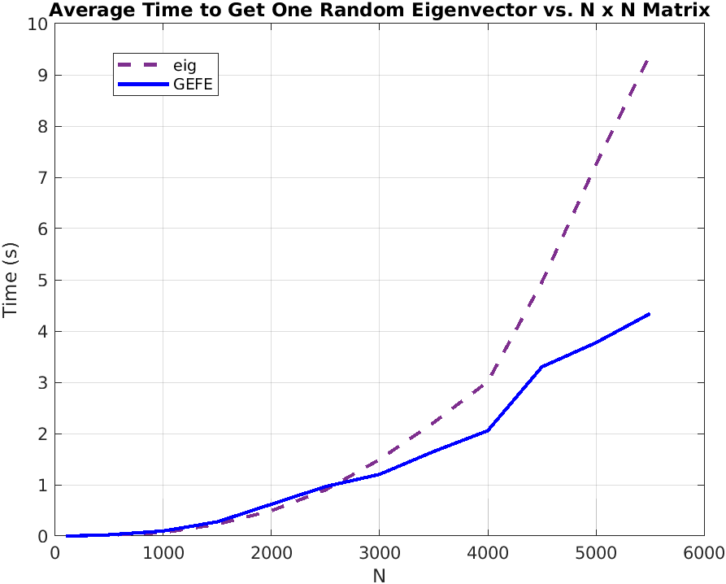
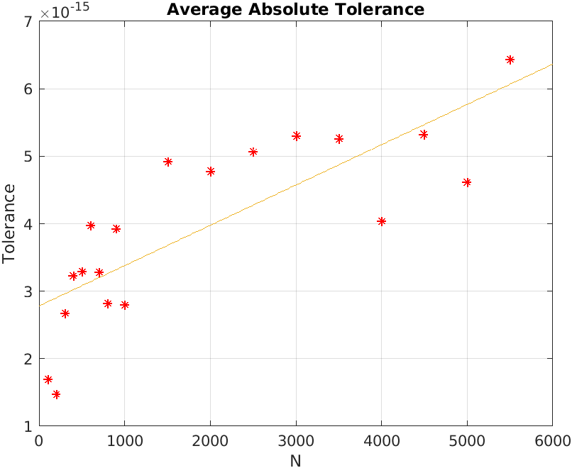

# Eigenvectors From Eigenvalues
- Implementing the formula necessary to compute normed eigenvectors given only eigenvalues in a Hermitian matrix.

<a href="https://www.codecogs.com/eqnedit.php?latex=\newline&space;\left&space;|&space;v_{i,j}&space;\right&space;|^{2}&space;=&space;\dfrac{\prod_{k=1}^{n-1}&space;(\lambda_{i}(H)&space;-&space;\lambda_{k}(h_{j}))}&space;{&space;\prod_{1&space;\leq&space;k&space;\leq&space;n}^{i&space;\neq&space;k}&space;(\lambda_{i}(H)&space;-&space;\lambda_{k}(H))}&space;\newline\newline\newline&space;{h_{j}}:&space;(n-1)\times(n-1)&space;\texttt{&space;matrix&space;with&space;jth&space;row&space;and&space;jth&space;column&space;removed.}&space;\newline&space;\lambda(H):&space;\texttt{&space;eigenvalues&space;of&space;}&space;H.&space;\newline&space;\lambda(h_{j}):&space;\texttt{&space;eigenvalues&space;of&space;}&space;h_{j}." target="_blank"></a>

## [MATLAB] A Few Statistics
- Read with suspicion. While these were conducted with MATLAB online, no effort was taken to determine whether other underlying factors may play a role here.
- These trials were conducted with 10 runs averaged per matrix size N. A technique introduced to minimize underflow is to divide numbers that are relatively close to each other in size. The goal is to get each division as close as possible to 1. This requires sorting the results of the product using MATLAB's sort(). While our precision did improve, it was at the cost of speed, since it requires sorting N elements twice. Still, it was quicker to find a random N eigenvector using GetEigenvectorsFromEigenvalues (GEFE) when N is large. To minimize this cost, MATLAB's parallel for loops were initiated when N was large.

- The absolute tolerance was measured by taking the average absolute tolerance of each value (compared with eig) in the given random eigenvector.

## [C++] Dependencies
- [Armadillo C++ Linear Algebra Library](http://arma.sourceforge.net/)
- [CMake 3.15 (or later)](https://cmake.org/)
- [Google Testing](https://github.com/google/googletest)

## Acknowledgements
- Authors of ["Eigenvectors from Eigenvalues"](https://arxiv.org/pdf/1908.03795.pdf): PETER B. DENTON, STEPHEN J. PARKE, TERENCE TAO, AND XINING ZHANG
- Cornell University Professor [Alex Townsend](https://github.com/ajt60gaibb) for mentorship and neat scientific computing tricks.
