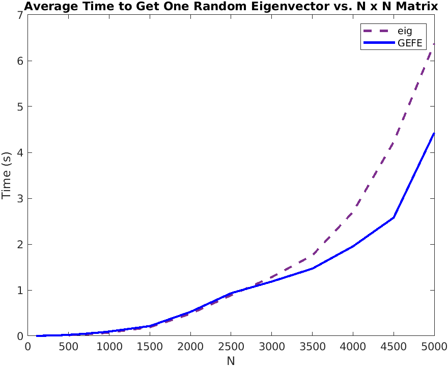

# EigenvectorsFromEigenvalues
Implementing the formula necessary to compute eigenvectors given only eigenvalues.

<a href="https://www.codecogs.com/eqnedit.php?latex=\newline&space;\left&space;|&space;v_{i,j}&space;\right&space;|^{2}&space;=&space;\dfrac{\prod_{k=1}^{n-1}&space;(\lambda_{i}(H)&space;-&space;\lambda_{k}(h_{j}))}&space;{&space;\prod_{1&space;\leq&space;k&space;\leq&space;n}^{i&space;\neq&space;k}&space;(\lambda_{i}(H)&space;-&space;\lambda_{k}(H))}&space;\newline\newline\newline&space;{h_{j}}:&space;(n-1)\times(n-1)&space;\texttt{&space;matrix&space;with&space;jth&space;row&space;and&space;jth&space;column&space;removed.}&space;\newline&space;\lambda(H):&space;\texttt{&space;eigenvalues&space;of&space;}&space;H.&space;\newline&space;\lambda(h_{j}):&space;\texttt{&space;eigenvalues&space;of&space;}&space;h_{j}." target="_blank"></a>

- See [Eigenvectors From Eigenvalues](https://arxiv.org/pdf/1908.03795.pdf) for proof. 

## Objectives
Since this formula can produce a specific eigenvector of the ith row and jth column, **"This may be useful when dealing with large matrices and only a few eigenvector values are needed."** (Professor A. Townsend, Cornell University). I intend to compare this with current industry standards, starting with MATLAB and then exploring other languages where matrices are fundamental.

Basic criteria include time and (eventually) space complexity, while also meeting precision requirements.

## TODOs
- Compare times for using sort() (to improve precision) versus not using sort(). If it greatly differs, think about adding an argument to allow for either better time or better precision.

## Initial Results
- These trials were conducted with 10 runs averaged per matrix size N. A technique introduced to minimize underflow is to divide numbers that are relatively close to each other in size. The goal is to get each division as close as possible to 1. This requires sorting the results of each Product using MATLAB's sort(). While our precision did improve, it was at the cost of speed, since it requires sorting N elements twice. Still, it was quicker to find a random N eigenvector using GEFE when N is large. 

- The absolute tolerance was measured by taking the average absolute tolerance of each value (compared with eig) in the given random eigenvector.

